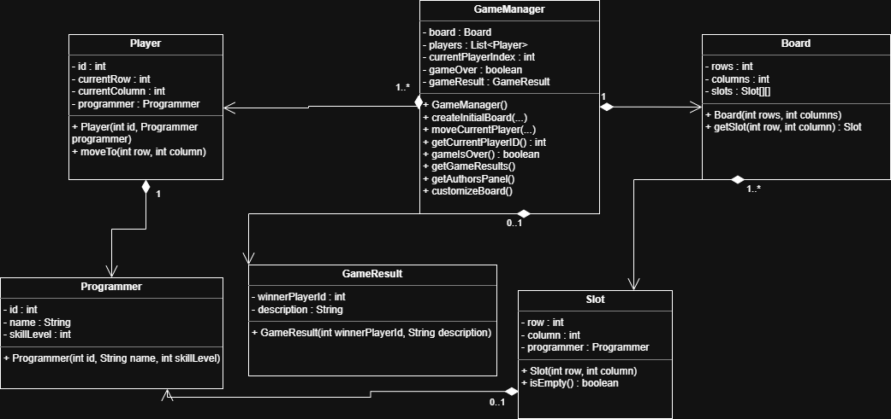

# The Great Programming Journey
Este proyecto forma parte del trabajo práctico de LP2.  
Aquí está implementada la lógica del juego **The Great Programming Journey**, usando Java y POO.
## ¿Qué hay en el proyecto?

- La lógica principal del juego está en la clase `GameManager`
- El tablero, jugadores y casillas están modelados con varias clases
- Hay tests unitarios hechos con JUnit 5 para comprobar que todo funciona
- El proyecto sigue las restricciones del enunciado (sin herencia, sin interfaces, etc.)

## Technologies
- Java 17
- JUnit 5
- IntelliJ IDEA
## UML Diagram
Aquí está el diagrama UML con el diseño de las clases del proyecto:

## Authors
Mirar **AUTHORS.txt**
